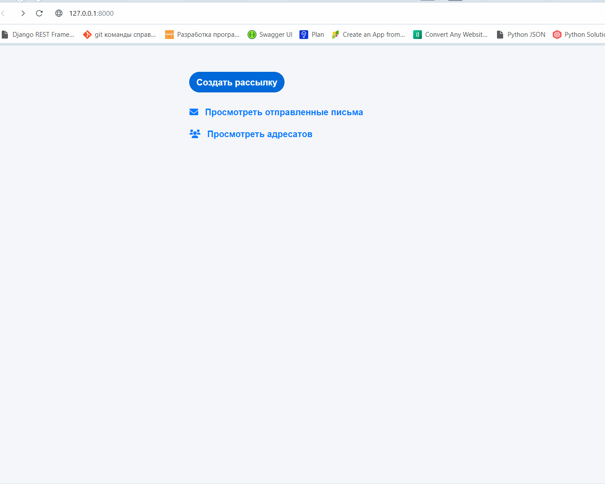
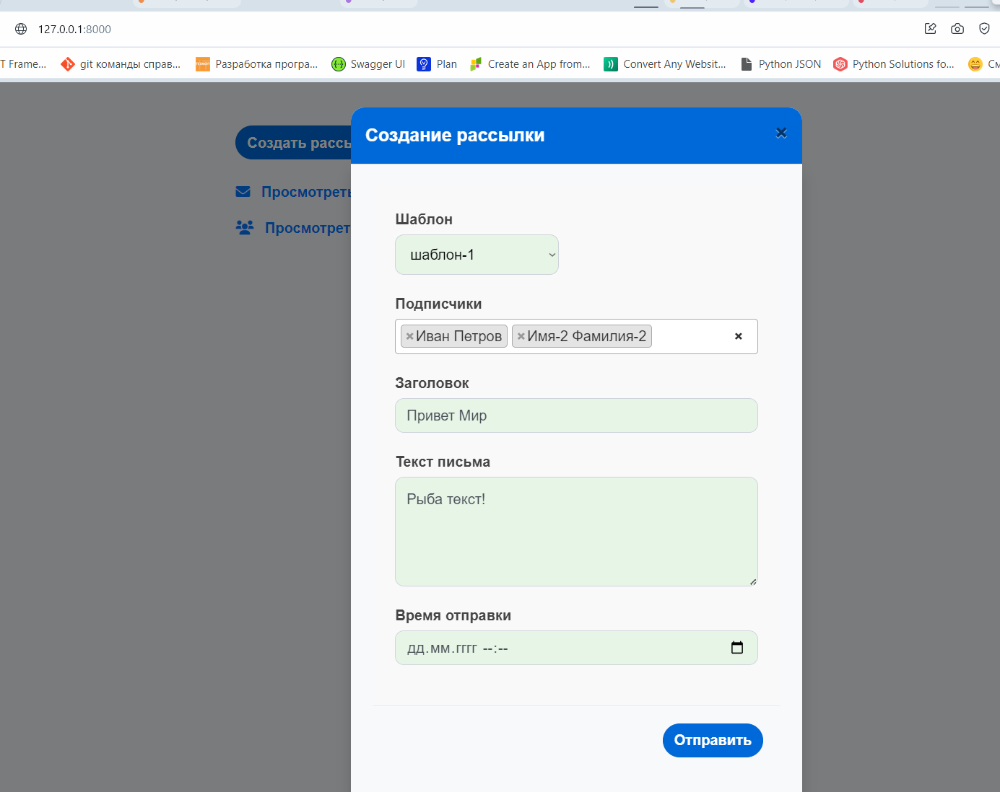
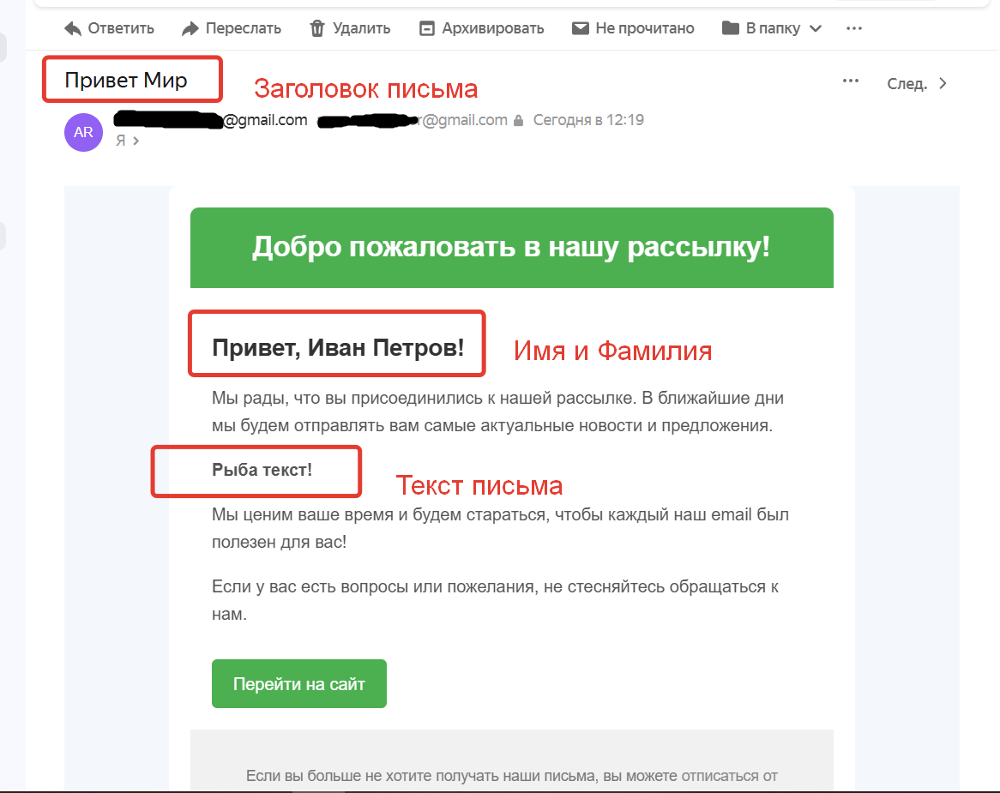
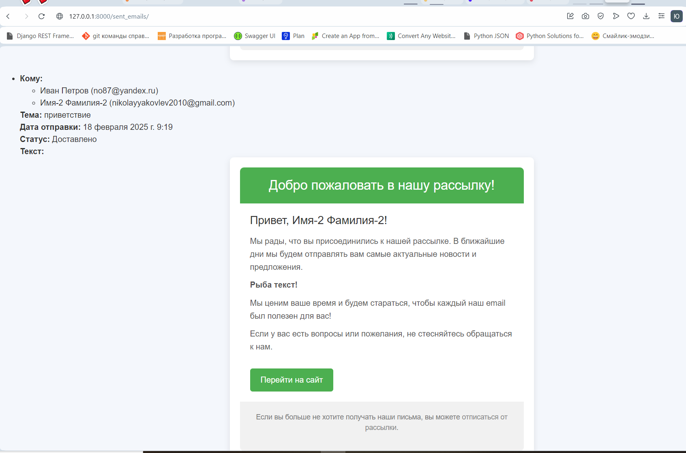
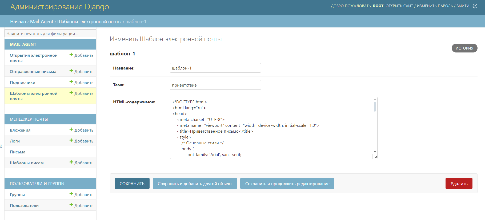
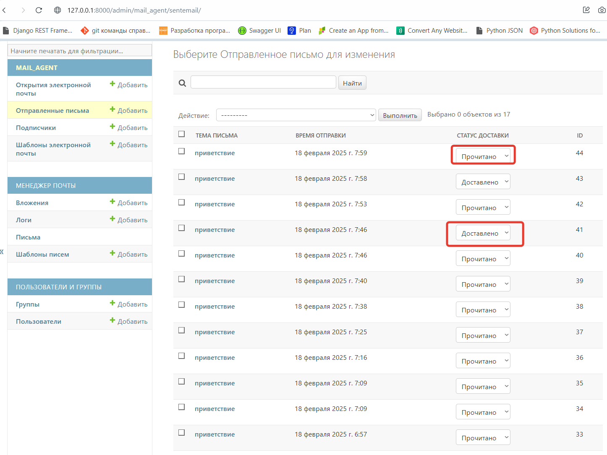
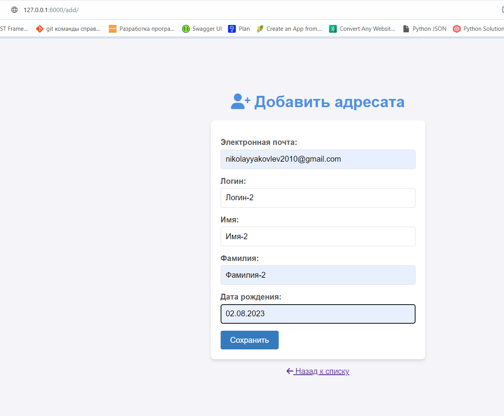
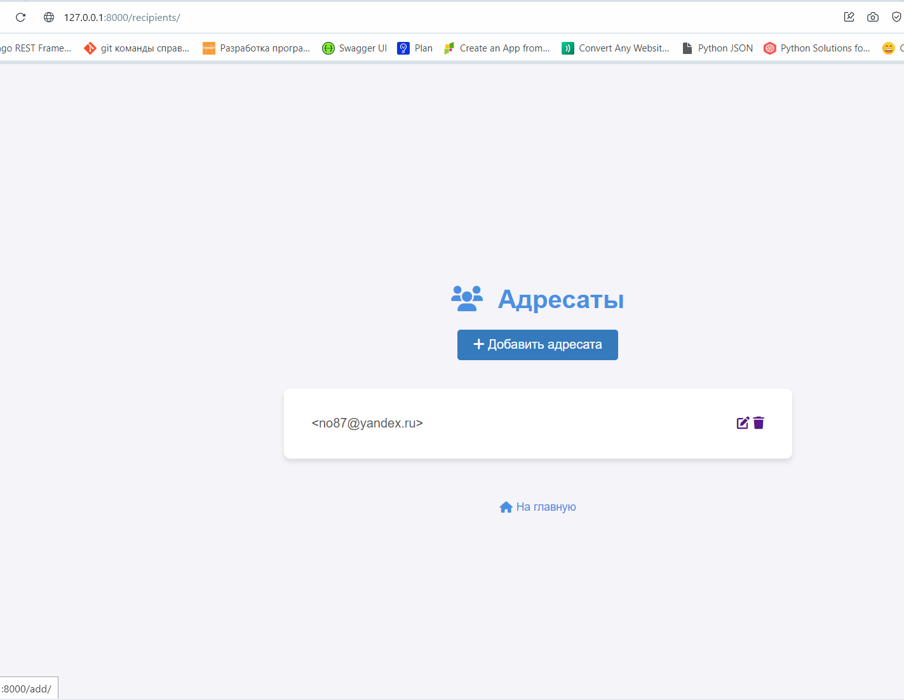
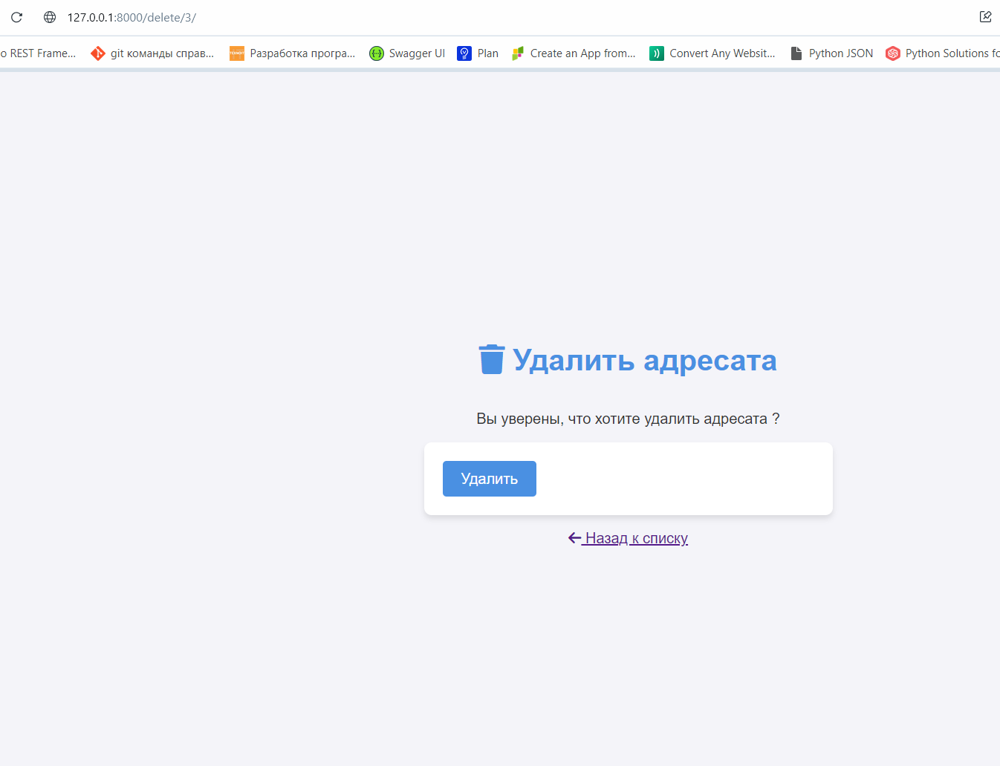

# Система рассылки писем

Этот проект представляет собой веб-приложение для управления рассылкой писем. С его помощью можно отправлять письма, отправлять отложенные письма (с использование Celery), отслеживать их открытия, управлять списком подписчиков и просматривать историю отправленных писем.

## Основные функции

- **Отправка рассылки**: Главная страница позволяет отправлять письма по списку подписчиков.
- **Отслеживание открытий**: Система отслеживает, когда письмо было открыто.
- **Управление подписчиками**: Добавление, редактирование и удаление подписчиков.
- **Просмотр отправленных писем**: Возможность просмотра истории отправленных писем.
- **Загрузка шаблонов и подписчиков**: Загрузка шаблонов писем и списка подписчиков из файлов.

## Установка и запуск

1. Клонируйте репозиторий:

2. Установите зависимости:
   
   pip install -r requirements.txt

3. Примените миграции:

   python manage.py migrate

4. Запустите сервер:

   python manage.py runserver

## URL-адреса

В проекте используются следующие URL-адреса:

- **Главная страница**: `"/"`  
  Отправка рассылки и вывод главной страницы.

- **Отслеживание открытий**: `"/track_open/"`  
  Отслеживание открытия письма.

- **Список подписчиков**: `"/recipients/"`  
  Просмотр списка подписчиков.

- **Добавление подписчика**: `"/add/"`  
  Добавление нового подписчика на рассылку.

- **Редактирование подписчика**: `"/edit/<int:recipient_id>/"`  
  Редактирование информации о подписчике.

- **Удаление подписчика**: `"/delete/<int:recipient_id>/"`  
  Удаление подписчика из списка.

- **История отправленных писем**: `"/sent_emails/"`  
  Просмотр истории отправленных писем.

- **Загрузка шаблонов**: `"/load_templates/"`  
  Загрузка шаблонов писем.

- **Загрузка подписчиков**: `"/load_subscribers/"`  
  Загрузка списка подписчиков из файла.

## Скриншоты

### Главная страница

### Создание рассылки

### Отправленное письмо

### Просмотр письма(странчка)

### Загрузка шаблона письма в админку

### Отслеживание статуса письма(доставлено/прочитано)

### Добавление адресата(страничка)

### Адресаты

### Удалить

# posta_office
